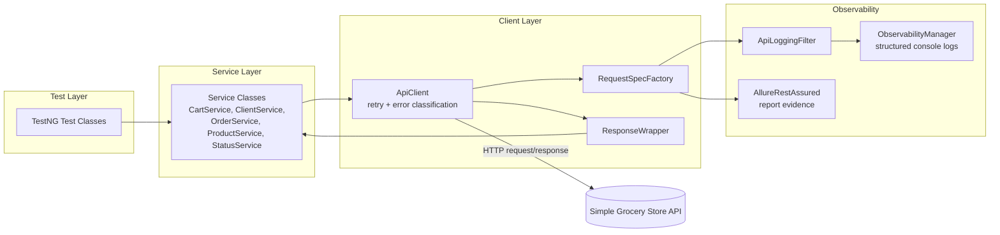
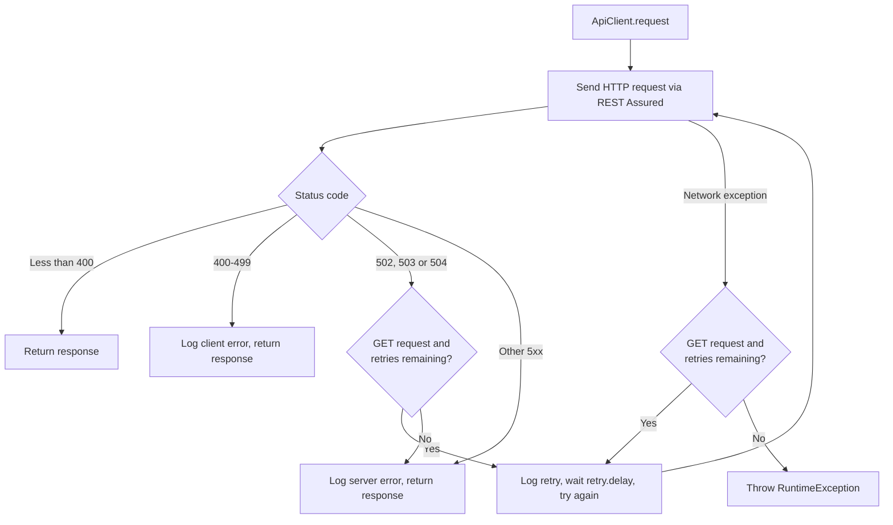

# Grocery Store API Automation Framework

[](https://github.com/SharifulIslamSabuj/api-automation-framework/actions/workflows/api-tests.yml)


A production-inspired REST Assured API automation framework built with Java 17 and TestNG, featuring layered architecture, runtime bearer-token authentication, reusable API components, Allure reporting, and GitHub Actions CI.

## 🛠 Technology Stack

| Category | Technology |
|-----------|------------|
| Language | Java 17 |
| Build Tool | Gradle (Wrapper) |
| Test Framework | TestNG |
| API Testing | REST Assured |
| Serialization | Jackson |
| Assertions | Hamcrest |
| Validation | JSON Schema Validation |
| Reporting | Allure Report, Gradle HTML Report |
| Logging | Structured Request & Response Logging |
| CI/CD | GitHub Actions |
| Authentication | Runtime Bearer Token Authentication |
| Design | Layered Architecture • Service Layer • Reusable API Client • POJO Models |
| Test Suites | Smoke • Regression • End-to-End |

---

## Overview

This project exercises the Products, Carts, Orders, API Clients, and Status endpoints of a public grocery-store demo API, covering both isolated API-level tests and a full order-placement end-to-end flow (browse products → create cart → add item → place order).

---

## Dependency Versions

Exact declared dependency versions, for contributors and dependency audits — see the Technology Stack table near the top of this README for an at-a-glance overview.

| Category | Technology | Version |
|---|---|---|
| Language | Java | 17 |
| Build Tool | Gradle Wrapper | 9.0.0 |
| API Testing | REST Assured | 6.0.0 |
| JSON Handling | REST Assured JSON Path | 6.0.0 |
| Schema Validation | REST Assured JSON Schema Validator | 6.0.0 |
| Test Runner | TestNG | 7.12.0 |
| JSON (De)serialization | Jackson Databind | 2.11.0 |
| Reporting | Allure TestNG | 2.32.0 |
| Reporting | Allure REST Assured | 2.32.0 |
| Report Generation | Allure Commandline (external tool) | 2.x |

---

## Framework Architecture



**Layer responsibilities**

| Layer | Responsibility |
|---|---|
| Test | TestNG test classes; assertions and schema validation via `BaseTest` |
| Service | One class per resource (`CartService`, `ClientService`, `OrderService`, `ProductService`, `StatusService`); builds requests and calls `ApiClient` |
| Client | `ApiClient` (execution + retry), `RequestSpecFactory` (shared request spec + filters), `ResponseWrapper` (typed response accessors) |
| Model | POJOs for request/response (de)serialization |
| Observability | `ApiLoggingFilter` and `ObservabilityManager` for structured logs; `AllureRestAssured` for report evidence |

---

## Project Structure

```
src/test/java/com/grocery/store/api
├── base
│   └── BaseTest.java                  # Shared assertion/validation helpers
├── client
│   ├── ApiClient.java                 # HTTP execution, retry, error classification
│   ├── ApiRoutes.java                 # Centralized endpoint path constants
│   ├── RequestSpecFactory.java        # Shared RequestSpecification + filter chain
│   └── ResponseWrapper.java           # Typed response accessors
├── config
│   └── ConfigManager.java             # Loads config.properties, resolves environment
├── filters
│   └── ApiLoggingFilter.java          # REST Assured filter for structured request/response logging
├── models
│   ├── request
│   │   ├── ClientRequest.java
│   │   └── OrderRequest.java
│   └── response
│       └── CreateOrderResponse.java
├── observability
│   └── ObservabilityManager.java      # Centralized structured logging
├── schema
│   └── JsonSchemaValidator.java       # JSON Schema validation
├── services
│   ├── CartService.java
│   ├── ClientService.java
│   ├── OrderService.java
│   ├── ProductService.java
│   └── StatusService.java
├── testdata
│   └── generator
│       └── TestDataFactory.java       # Centralized dynamic test data
├── tests
│   ├── api
│   │   ├── CartApiTest.java
│   │   ├── ClientApiTest.java
│   │   ├── OrderApiTest.java
│   │   ├── ProductApiTest.java
│   │   └── StatusApiTest.java
│   └── e2e
│       └── OrderE2ETest.java
└── utils
    ├── AssertionUtil.java             # Lightweight assertion helpers
    └── TokenManager.java              # Lazy, cached bearer-token provider

src/test/resources
├── allure.properties
├── config.properties
├── schemas
│   ├── cart-schema.json
│   ├── order-schema.json
│   └── products-schema.json
├── testng-e2e.xml
├── testng-regression.xml
└── testng-smoke.xml
```

---

## Execution Flow



---

## Installation

### Prerequisites

Running the tests requires only:

- Java 17

Generating the Allure HTML report additionally requires:

- Allure Commandline, installed and available on `PATH`

Install Allure Commandline with any of the following:

```bash
npm install -g allure-commandline
scoop install allure        # Windows
brew install allure          # macOS
```

> [!NOTE]
> Test execution does not depend on Allure Commandline. TestNG results (`build/test-results`) and Gradle's own HTML report (`build/reports/tests/test/index.html`) are produced regardless.
>
> `generateSingleAllureHtml` is wired as `finalizedBy` on the `test` task, so if Allure Commandline is missing, `./gradlew test` will still execute all tests correctly but the overall command will exit with `BUILD FAILED` when that final reporting step fails. Install Allure Commandline to get a clean `BUILD SUCCESSFUL` and the generated report.

### Clone and verify setup

```bash
git clone https://github.com/SharifulIslamSabuj/api-automation-framework.git
cd api-automation-framework
./gradlew clean test
```

---

## Configuration

Configuration lives in [`src/test/resources/config.properties`](src/test/resources/config.properties):

| Key | Description | Default |
|---|---|---|
| `dev.base.url` | Base URL for the `dev` environment | `https://simple-grocery-store-api.click` |
| `qa.base.url` | Base URL for the `qa` environment | `https://simple-grocery-store-api.click` |
| `prod.base.url` | Base URL for the `prod` environment | `https://simple-grocery-store-api.click` |
| `connection.timeout` | HTTP connection timeout (ms) | `5000` |
| `read.timeout` | HTTP socket read timeout (ms) | `10000` |
| `retry.count` | Additional retry attempts for retryable `GET` failures | `1` |
| `retry.delay` | Delay between retry attempts (ms) | `1000` |

The active environment defaults to `dev` (`ConfigManager`, backed by the `env` system property). The `test` task in `build.gradle` forwards `-Denv` to the test JVM (`systemProperty "env", System.getProperty("env", "dev")`), so `./gradlew test -Denv=qa` does reach `ConfigManager`. Only `dev`, `qa`, and `prod` are supported — any other value (including typos) now fails fast with a clear `IllegalArgumentException` before any request is sent, rather than silently falling back to another profile. All three environment URLs currently point to the same public sandbox API, so environment selection has no visible effect on requests today regardless.

To point at a different base URL entirely without editing `config.properties`, pass `-DbaseUrl=<url>` (also forwarded by `build.gradle`); it takes precedence over the resolved environment profile. This is intended for ad hoc overrides (e.g. a personal fork of the sandbox, or a future CI-provided endpoint) rather than day-to-day use.

No static credentials are required to run this suite. `TokenManager` registers a fresh, uniquely-named API client (`POST /api-clients`) on first use and caches the returned bearer token for the rest of the JVM — there is nothing to configure or provide up front.

---

## Running Tests

```bash
# Run every test in the project
./gradlew clean test

# Run a single test class
./gradlew test --tests "com.grocery.store.api.tests.api.ProductApiTest"

# Run every test in a package
./gradlew test --tests "com.grocery.store.api.tests.api.*"

# Run a specific TestNG suite
./gradlew test -Psuite=smoke
./gradlew test -Psuite=regression
./gradlew test -Psuite=e2e

# Full build (compile, test, generate Allure report)
./gradlew clean build

# Regenerate the Allure HTML report from existing results
./gradlew generateSingleAllureHtml
```

### TestNG Groups & Suites

| Test Class | Groups |
|---|---|
| `CartApiTest` | `smoke`, `regression` |
| `ClientApiTest` | `regression` |
| `OrderApiTest` | `regression` |
| `ProductApiTest` | `smoke`, `regression` |
| `StatusApiTest` | `smoke` |
| `OrderE2ETest` | `smoke`, `regression`, `e2e` |

| Suite File | Group Filter | Classes Executed |
|---|---|---|
| `testng-smoke.xml` | `smoke` | CartApiTest, ProductApiTest, StatusApiTest, OrderE2ETest |
| `testng-regression.xml` | `regression` | CartApiTest, ClientApiTest, OrderApiTest, ProductApiTest, OrderE2ETest |
| `testng-e2e.xml` | `e2e` | OrderE2ETest |

---

## Continuous Integration

A single GitHub Actions workflow ([`.github/workflows/api-tests.yml`](.github/workflows/api-tests.yml)) runs on Ubuntu with Java 17 (Temurin) and executes the exact same `./gradlew` commands documented above — nothing CI-specific is required to reproduce a run locally.

| Trigger | What runs | Tests |
|---|---|---|
| Pull request → `main` | Compile, then the smoke suite | 4 |
| Push to `main` | The regression suite (already includes the E2E test) | 16 |
| Manual (`workflow_dispatch`) | Operator picks a suite (`default` / `smoke` / `regression` / `e2e`) and environment (`dev` / `qa` / `prod`) from constrained dropdowns | varies |

There is no scheduled run — this is a portfolio project without an active on-call team, so an unattended recurring job against the public sandbox wouldn't have a consumer; the manual trigger already covers on-demand health checks.

Every run uploads the raw `allure-results` and Gradle's HTML test report as workflow artifacts (14-day retention), even on failure, so a red run can be investigated without re-running it. No credentials are configured in the workflow — the framework registers its own API client and bearer token at runtime (see [Authentication](#authentication)), and the same Authorization/token redaction described there applies identically in CI, since it's the same code path.

This workflow has been verified on GitHub's own runners, not just locally: the regression suite has passed with all 16 tests (including the E2E test) on multiple real runs, with artifacts uploading correctly and no token appearing in any remote log or artifact.

---

## Retry Strategy

Retry logic lives in `ApiClient` and is intentionally conservative:

| Condition | Behavior |
|---|---|
| `GET` request returns `502`, `503`, or `504` | Retried up to `retry.count` additional times, waiting `retry.delay` ms between attempts |
| `GET` request throws a network exception (timeout, connection failure) | Retried the same way |
| Any other `5xx` response (e.g. `500`, `501`) | Logged and returned immediately — not retried |
| Any `4xx` response | Logged and returned immediately — never retried |
| `POST` / `PUT` / `PATCH` / `DELETE` requests | Never retried by default, to avoid duplicating non-idempotent operations |
| All retry attempts exhausted due to exceptions | A clear `RuntimeException` is thrown — a failed call never silently returns `null` |

Every retry attempt is logged through `ObservabilityManager.logRetry(...)`, including the attempt number, reason, and delay.

---

## Logging

Two components share logging responsibility, each with a distinct purpose:

- **`ObservabilityManager`** — structured, timestamped console logs (`[REQUEST]`, `[RESPONSE]`, `[CLIENT_ERROR]`, `[SERVER_ERROR]`, `[NETWORK_ERROR]`, `[RETRY]`, `[PROFILE]`) for every request lifecycle event.
- **`ApiLoggingFilter`** — a REST Assured `Filter` that captures method, URI, status code, and response time for every call and routes them through `ObservabilityManager`.

Full request/response payload evidence (headers, body, curl-equivalent command) is handled separately by `AllureRestAssured` and lives in the Allure report rather than the console, avoiding duplicate logging.

---

## Reporting

- Allure results are written to `build/allure-results` (configured via `allure.properties` and reinforced by the Gradle `test` task).
- After every test run, the `generateSingleAllureHtml` task (wired via `finalizedBy`) produces a single-file HTML report — locally, when Allure Commandline is installed (see [Installation](#installation)); CI does not install it and instead uploads the raw Allure results and Gradle's HTML report as workflow artifacts (see [Continuous Integration](#continuous-integration)) — at:

  ```
  build/allure-report/GroceryStore-ApiAutomationReport.html
  ```

- Gradle's own default test report is also generated at `build/reports/tests/test/index.html`, independent of Allure.

---

## JSON Schema Validation

| Schema File | Validates | Used In |
|---|---|---|
| `cart-schema.json` | Add-to-cart response | `CartApiTest` |
| `products-schema.json` | Product list response | `ProductApiTest` |
| `order-schema.json` | Order creation response | `OrderE2ETest` |

Validation is performed via `BaseTest.validate(response, schemaFileName)`, which delegates to `JsonSchemaValidator`, backed by REST Assured's `json-schema-validator` module.

---

## Authentication

Some endpoints (placing an order, creating a client with an existing token) require a bearer token. `TokenManager` lazily creates one API client via `POST /api-clients` on first use and caches the returned `accessToken` for the remainder of the test run, using a synchronized accessor so concurrent test threads share a single token instead of creating one each.

The real `Authorization` header value and the `accessToken` field in the client-registration response body are never written to the console, and are redacted (`[ BLACKLISTED ]`) in Allure's HTTP evidence and the generated HTML report — only the fact that authentication was attempted is visible, not the value.

---

## Test Data Strategy

`TestDataFactory` centralizes generation of dynamic test data (client names/emails, customer names, cart quantities). Generated values combine a timestamp with a shared `AtomicLong` counter — a timestamp alone was proven to collide under real thread contention (multiple threads can call `System.currentTimeMillis()` within the same millisecond), so the counter guarantees uniqueness regardless of parallel execution. See [Known Limitations](docs/quality/KNOWN_AUT_LIMITATIONS.md) for what this does and doesn't clean up remotely.

---

## Quality & Reliability Documentation

Across 40 controlled suite runs (380 test executions), no framework-attributable flakiness was observed during the qualification window — see the assessment below for full methodology and evidence.

- [Known Limitations](docs/quality/KNOWN_AUT_LIMITATIONS.md) — external/public-sandbox constraints this framework works around, not framework defects
- [Final Project Assessment](docs/quality/FINAL_PROJECT_ASSESSMENT.md) — architecture, coverage, security, reliability, and reusability qualification, backed by controlled repeated-execution evidence

**Latest published release:** [v1.0.0](https://github.com/SharifulIslamSabuj/api-automation-framework/releases/tag/v1.0.0). `main` may contain documentation-only changes made after that release.

---

## Author

**Md. Shariful Islam**
Senior QA Automation Engineer
GitHub: [@SharifulIslamSabuj](https://github.com/SharifulIslamSabuj)

---

## License

[MIT](LICENSE)
